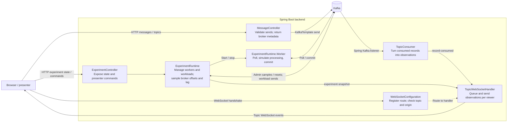

# Kafka live demonstrations

A small Kotlin / Spring Boot service that produces UTF-8 string messages and streams consumed records over plain JSON WebSockets. It defaults to the workshop broker advertised at `localhost:9094`.

## Project documentation

- [BACKLOG.md](BACKLOG.md): lesson roadmap and acceptance plans.
- [INTENT.md](INTENT.md): project goals and evolving scope.
- [CONTEXT.md](CONTEXT.md): current implementation, working context, and verification history.
- [Architecture decisions](docs/adr/README.md): accepted decisions and proposals.
- [Adding lessons](docs/ADDING_LESSONS.md): slide and concept recipes, extension boundaries, and verification.
- [Agent skill](.agents/skills/add-kafka-lesson/SKILL.md): reusable lesson-authoring workflow, stored in the repository's skill discovery directory. Invoke `$add-kafka-lesson`; `AGENTS.md` also routes repository agents to it. No personal installation is needed. If it does not appear immediately, restart Codex. See [Codex skill discovery](https://learn.chatgpt.com/docs/build-skills#where-codex-loads-local-skills).

## Run

Requires JDK 17 and the workshop Kafka broker. Create both demo topics once in the current Docker context:

If your default Java is newer than the Gradle wrapper supports, set `JAVA_HOME` to a JDK 17 installation first.

```sh
docker exec kafka1 kafka-topics --bootstrap-server kafka1:9092 \
  --create --if-not-exists --topic kafka-demo --partitions 3 --replication-factor 1
docker exec kafka1 kafka-topics --bootstrap-server kafka1:9092 \
  --create --if-not-exists --topic kafka-demo-lab --partitions 3 --replication-factor 1
./gradlew bootRun
```

The backend listens at `http://localhost:8080`. Topics must exist before startup; the consumer does not create topics. Existing topics are never resized by the application. The optional experiment API can reset offsets only for its inactive allowlisted groups.

The workshop Compose stack also includes [Kafbat UI](http://localhost:8081). Open **workshop → Topics → kafka-demo → Messages** and compare a presentation record's topic, partition, offset, key, and value. Kafbat connects to the same broker through `kafka1:9092`; select String deserialization for demo keys and values. See the [workshop instructions](../kafka-workshop/README.md#browse-records-with-kafbat-ui) for startup details.

## Start and switch between decks

For the existing local Docker setup, use:

```sh
./scripts/decks.sh lessons    # Switch to Kafka lessons
./scripts/decks.sh migration  # Switch to migration
./scripts/decks.sh both       # Run both decks
./scripts/decks.sh status     # Show backend and infrastructure status
./scripts/decks.sh stop       # Stop decks, leave infrastructure running
```

The script uses the current Docker context and saved containers. It starts the
saved `kafka1` broker for lessons; migration requires the Kind POC already running.
It waits for the requested backend's HTTP API before stopping the other deck.
HTTP readiness does not establish Kafka/source freshness: check the deck's live
indicators before presenting. No builds, container creation, cluster setup or
migration commands are performed. First-time setup and manual alternatives follow.

Use separate backend instances to keep the two demos independent:

| Deck | Profile | Browser URL | Infrastructure |
| --- | --- | --- | --- |
| Kafka lessons | Default (no active profile) | http://localhost:8080/ | Workshop Kafka and both demo topics from **Run** above |
| Proxy migration | `migration` | http://localhost:18080/migration.html#/migration-flow | Kind POC, `kind-kafka-proxy-poc`, legacy Kafka port forward and telemetry credentials |

For host execution, build once with JDK 17, then run the same JAR in two terminals.
Complete the [migration prerequisites and authentication](#kroxy-migration-presentation)
first; the commands below assume the exported config and client properties are in
`.local/`. Ensure these ports and observer groups are not already in use by the
Docker instances described below.

```sh
./gradlew bootJar
```

Terminal 1 — Kafka lessons:

```sh
SPRING_PROFILES_ACTIVE=default PORT=8080 DEMO_MIGRATION_ENABLED=false \
KAFKA_BOOTSTRAP_SERVERS=localhost:9094 \
java -jar build/libs/kafka-demo-0.1.0-SNAPSHOT.jar
```

Terminal 2 — migration presentation:

```sh
KUBECONFIG="$PWD/.local/kubeconfig" \
DEMO_MIGRATION_TELEMETRY_CLIENT_PROPERTIES="$PWD/.local/telemetry-client.properties" \
DEMO_MIGRATION_CONTEXT=kind-kafka-proxy-poc \
WEBSOCKET_ALLOWED_ORIGINS=http://localhost:18080,http://127.0.0.1:18080 \
SPRING_PROFILES_ACTIVE=migration PORT=18080 \
java -jar build/libs/kafka-demo-0.1.0-SNAPSHOT.jar
```

Both can stay running: switch browser tabs to switch decks. To run only one, stop
the other process with Ctrl+C. Profiles are selected at backend startup; opening
`/` on the migration instance does not enable the lesson controls. The migration
profile disables the workshop observer, experiments and producer API.

### Existing local Docker instances

The development setup has used `kafka-demo` for lessons on port 8080 and
`kafka-demo-migration-live` for migration on port 18080. Check the current Docker
context and saved containers before using these commands:

```sh
docker context show
docker ps -a --format 'table {{.Names}}\t{{.Status}}\t{{.Ports}}'
docker start kafka-demo
docker start kafka-demo-migration-live
```

These commands resume existing containers; they do not create missing containers
or start their Kafka infrastructure. See [Build and run using Docker](#build-and-run-using-docker)
to create the lesson container. The local migration container uses exported
credentials and a Docker-specific kubeconfig, with setup notes in
[CONTEXT.md](CONTEXT.md#live-migration-observation-verified-2026-09-11).

Stop either backend with `docker stop kafka-demo` or
`docker stop kafka-demo-migration-live`. After resetting the POC, use
`docker restart kafka-demo-migration-live` to recreate its port forward if needed.
Restarting a backend begins a new in-memory observation window; browser reconnect
only reconnects the viewer. Do not run a second migration backend in the same
observer group.

Stop all backend processes/containers using the built JAR before rebuilding it,
then restart them and reload both pages. Replacing a JAR while it is being served
can leave the running application with inconsistent resources.

### Use POC legacy Kafka for the lesson deck

The `poc-legacy` profile runs the full lesson backend against the POC's **direct
legacy listener**, with no workshop broker required. It does not route lesson
traffic through Kroxylicious. Use this profile by itself, not together with
`migration`, which disables lesson features.

Start the POC, then keep this port forward running in a separate terminal:

```sh
kubectl --context kind-kafka-proxy-poc --namespace kafka-platform-poc \
  port-forward svc/legacy-broker 32095:32095
```

Reuse `.local/telemetry-client.properties` from the migration setup, or supply
another standard Kafka client properties file with POC credentials. The profile
requires `KAFKA_CLIENT_PROPERTIES` and reads `sasl.jaas.config` from that file;
it configures SASL_PLAINTEXT / SCRAM-SHA-512 for producers, observers and experiment
clients. Keep the file local and restricted. Bootstrap and group settings come
from the profile, not unprefixed settings in the client properties file.

Create the lesson topics once using the Kafka CLI, with credentials authorized
for topic creation (run from this checkout with `kafka-topics` on PATH):

```sh
kafka-topics --bootstrap-server localhost:32095 \
  --command-config "$PWD/.local/telemetry-client.properties" \
  --create --if-not-exists --topic kafka-demo --partitions 3 --replication-factor 1
kafka-topics --bootstrap-server localhost:32095 \
  --command-config "$PWD/.local/telemetry-client.properties" \
  --create --if-not-exists --topic kafka-demo-lab --partitions 3 --replication-factor 1
```

Stop any existing lesson backend on port 8080, build the JAR as described above,
and start with JDK 17. On macOS, select it explicitly (the default `java` may be a
different version):

```sh
KAFKA_CLIENT_PROPERTIES="$PWD/.local/telemetry-client.properties" \
SPRING_PROFILES_ACTIVE=poc-legacy PORT=8080 \
"$(/usr/libexec/java_home -v 17)/bin/java" -jar build/libs/kafka-demo-0.1.0-SNAPSHOT.jar
```

Open http://localhost:8080/. The migration deck can remain on port 18080.
The lesson observer group defaults to `kafka-demo-poc-observer`, with experiment
groups `kafka-demo-poc-experiment-a` and `-b`. Lessons use `kafka-demo` and
`kafka-demo-lab`, separate from the POC's `demo.topic*` and `telemetry` topics.
The lesson credential needs read/write access to the lesson topics and group
permissions for the observer and experiments, including lesson offset resets.

The existing `decks.sh` script resumes saved Docker containers; it does not change
their profiles or Kafka connection. This host command is the configuration option
for now. A container using this profile needs its own reachable port forward:
the legacy listener advertises `localhost:32095`, so a bootstrap hostname alone
cannot make a host port forward accessible inside a container.

The local verified Docker instance for this profile is `kafka-demo-poc-legacy`,
on port 8080. It has its own legacy port forward and uses Java 17. If this saved
container exists, resume it with `docker start kafka-demo-poc-legacy` and stop it
with `docker stop kafka-demo-poc-legacy`. Stop it before starting the workshop
`kafka-demo` container or a host backend, since they share port 8080. The current
`decks.sh` script controls the workshop lesson container, not this additional one.

If acknowledgments time out, check that the port forward is running in the same
network environment as the backend and that both lesson topics exist. An
`AdminClient thread has exited` error describes a stopped client; inspect the
earlier exception for its cause, then restart the backend after correcting it.
Browser reconnect does not recreate the backend's AdminClient.

## Live slides

Open `http://localhost:8080/` after starting the application. The reveal.js deck introduces partitioning, offers predictions, runs a live producer/consumer experiment, and points to the Kotlin code to change.

On the experiment slide, select a configured topic, send several records with `customer-1`, then change the key or leave it empty for a null key. The acknowledgment reports the broker's partition and offset; cards appear only from the separate WebSocket consumption stream. Only observed partitions appear, and each retains four cards. Clear display resets browser observations only.

The deck keeps one WebSocket alive across slide navigation and retries closed connections with capped backoff. Reconnect does not replay missed observations. A subscription confirms the viewer connection, not Kafka partition assignment; wait for the backend's assignment log before presenting. Opening another window adds a viewer, not a Kafka consumer.

Use arrow keys to navigate, Esc for overview, and F for fullscreen. Form controls retain their normal keyboard behavior. Pinned reveal.js 5.2.1 assets and their MIT license are included under `static/vendor/reveal`. The slides need no external network access or frontend build at runtime.

To refresh the bundled library after intentionally changing its version in `package.json`, run `npm install` and `npm run vendor`, then commit the lockfile and vendor assets. For an unchanged lockfile, use `npm ci` instead. Gradle includes the checked-in assets in the application JAR.

The frontend is plain JavaScript served by Spring Boot from `src/main/resources/static`, using same-origin HTTP and WebSocket URLs. `index.html` defines the lesson, `js/slides.js` wires navigation and controls, `js/live-client.js` owns transport, and `js/concepts/partitioning.js` renders observations. New concepts register a mount function that returns `onRecord` and `reset`, with optional `onExperiment` for experiment snapshots. Commands are wired separately in `js/controls`.

## Produce a record with curl

```sh
curl -sS http://localhost:8080/api/messages \
  -H 'Content-Type: application/json' \
  -d '{"key":"customer-1","value":"Hello Kafka"}'
```

An optional `topic` selects another configured topic. Otherwise `KAFKA_DEFAULT_TOPIC` is used. The required `value` is a string (up to 16,384 characters); `key` is optional (up to 1,024 characters). JSON payloads can be encoded inside the string. This version does not use Avro or Schema Registry.

HTTP 200 means Kafka acknowledged the write. The response contains its actual `topic`, `partition`, `offset`, and `timestamp`. Malformed requests return 400, unconfigured topics return 404, and Kafka send failures return 503. A timeout can be ambiguous: the broker may have accepted a record even if the acknowledgment was not received. Retrying an HTTP request may produce a duplicate.

`GET /api/topics` lists the configured topics and default. It is configuration discovery, not a broker health check.

## Subscribe over WebSocket

Open `http://localhost:8080/api/topics` in a browser, then run in its developer console:

```js
const socket = new WebSocket('ws://localhost:8080/ws/topics/kafka-demo');
socket.onmessage = event => console.log(JSON.parse(event.data));
socket.onclose = event => console.log('Stream closed', event.code, event.reason);
```

The first event is `{"type":"subscribed","version":1,"topic":"kafka-demo"}`. This confirms the WebSocket subscription, not Kafka partition assignment. Once the backend consumer has joined its group, subsequent events look like:

```json
{
  "type": "record-consumed",
  "version": 1,
  "topic": "kafka-demo",
  "partition": 0,
  "offset": 42,
  "timestamp": 1788800000000,
  "key": "customer-1",
  "value": "Hello Kafka",
  "headers": []
}
```

Headers preserve their order and duplicate names; binary values use `valueBase64`. Kafka tombstones appear as a null `value`. Partition and offset identify the Kafka record; ordering is only meaningful within each partition.

- One application consumer subscribes to every configured topic at startup. Each WebSocket selects one of those topics by URL. Closing a socket unsubscribes that viewer, without changing Kafka membership.
- Multiple viewers receive copies of the same consumed records. Run one backend instance for this version; instances sharing a group divide partitions, so their viewers would see different subsets.
- With no viewers for a topic, consumed records are logged and discarded from the display pipeline. Batch offset commits continue. This does not delete records from Kafka.
- WebSocket delivery is best-effort, with no replay or client acknowledgment. Reconnecting resumes observations as they arrive. Consumer restarts can still redeliver uncommitted records or process a retained backlog; `latest` applies only when the group has no valid committed offset.
- Each viewer has a queue of 64 events and a dedicated sender. A slow viewer or an event larger than 256 KiB closes that stream with code 1008. At most 32 viewers connect at once. Kafka does not wait on socket sends.

## Configuration

See `.env.example`. Export variables in the shell before starting; Spring does not automatically read that file.

| Variable | Default | Purpose |
| --- | --- | --- |
| `KAFKA_BOOTSTRAP_SERVERS` | `localhost:9094` | Workshop broker; comma-separated for multiple brokers |
| `KAFKA_TOPICS` | `kafka-demo,kafka-demo-lab` | Topic allowlist consumed at startup |
| `KAFKA_DEFAULT_TOPIC` | `kafka-demo` | Default producer topic; must be in the allowlist |
| `KAFKA_GROUP_ID` | `kafka-demo` | Dedicated group, independent of workshop consumers |
| `PORT` | `8080` | HTTP and WebSocket port |
| `SERVER_ADDRESS` | `127.0.0.1` | Local bind address |
| `WEBSOCKET_ALLOWED_ORIGINS` | localhost:8080, 127.0.0.1:8080, localhost:5173 (HTTP) | Allowed browser origins |

For example, after creating both topics:

```sh
KAFKA_TOPICS=kafka-demo,orders DEMO_EXPERIMENT_ENABLED=false KAFKA_DEFAULT_TOPIC=orders ./gradlew bootRun
```

All standard `spring.kafka.*` properties remain available for security and consumer/producer tuning. The HTTP API has no authentication and defaults to loopback for local workshops. HTTP browser CORS is not enabled; the slides use the backend's origin. When changing `PORT` or the browser hostname, include that origin in `WEBSOCKET_ALLOWED_ORIGINS`.

## Backend structure and code to teach from

The backend is one Spring Boot application, with all classes in
`src/main/kotlin/io/bekk/kafkademo`. HTTP controllers accept presenter requests;
Kafka consumers supply observations; one WebSocket handler delivers them to
viewers. The ordinary producer path uses `KafkaTemplate` directly, so the code
responsible for a send is easy to find.

There are two independent consumption paths. `TopicConsumer` observes configured
topics from startup, even with no viewers. The `ExperimentRuntime` owns
separate consumer groups for the groups, replay and lag lessons; its workers start
only on explicit commands. Opening a socket or navigating slides changes neither
path's Kafka membership.



Arrows show the main calls and event paths, not every injected dependency. Startup
and shared configuration are described below.

| Class / file | Responsibility and useful changes to inspect |
| --- | --- |
| [Application](src/main/kotlin/io/bekk/kafkademo/Application.kt) | Boot entry point; discovers components and configuration properties. |
| [DemoProperties](src/main/kotlin/io/bekk/kafkademo/DemoProperties.kt) | Holds and validates the topic allowlist and producer default; holds allowed WebSocket origins. |
| [MessageController](src/main/kotlin/io/bekk/kafkademo/MessageController.kt) | Lists configured topics, validates production requests, sends through `KafkaTemplate`, and returns acknowledgment metadata. Request/response data classes live here too. |
| [TopicConsumer](src/main/kotlin/io/bekk/kafkademo/TopicConsumer.kt) | Converts Spring Kafka listener records into the `ConsumedMessage` envelope defined in the same file, then publishes to viewers. |
| [ExperimentController](src/main/kotlin/io/bekk/kafkademo/ExperimentController.kt) | Thin HTTP adapter for runtime snapshots and commands; translates command failures into HTTP responses. |
| [ExperimentRuntime](src/main/kotlin/io/bekk/kafkademo/ExperimentRuntime.kt) | Validates experiment commands; owns worker lifecycle, per-group delay, bounded workloads/history, broker sampling and inactive-group offset resets. Its private `Worker` contains the plain `KafkaConsumer` poll/process/commit loop. |
| [TopicWebSocketHandler](src/main/kotlin/io/bekk/kafkademo/TopicWebSocketHandler.kt) | Owns viewer connections, bounded queues and sender threads; fans out by topic and disconnects slow viewers. Retains the latest experiment snapshot for reconnects, but no consumed-record replay buffer. |
| [WebSocketConfiguration](src/main/kotlin/io/bekk/kafkademo/WebSocketConfiguration.kt) | Registers the socket route, origin allowlist and topic-checking handshake; also exposes `demoTopicNames` for the Kafka listener. |
| [application.yml](src/main/resources/application.yml) | Supplies cluster connection, observer group, acknowledgment policy, producer settings and environment overrides. |

The WebSocket boundary keeps socket writes off Kafka's listener thread. A
`record-consumed` event establishes that the observer received a record; processing
and commit observations come from the separate experiment workers. The demo's
processing step is a configurable sleep, not an external business operation.

## Tests

```sh
./gradlew test
./gradlew bootJar
```

Integration tests run their own embedded KRaft broker and real HTTP/WebSocket server. They cover producer-to-viewer delivery, fan-out, topic isolation, Kafka offsets advancing without viewers, reconnect behavior, and request validation. A separate test exercises a blocked WebSocket sender and queue overflow. They do not depend on or alter the workshop broker.

Browser smoke tests require the running application and its Kafka consumer to have partition assignments. They **produce six records** into the configured default topic, check real acknowledgments against observed cards, bounded display history, literal rendering of HTML-like input, navigation without socket replacement, reconnect, and a simulated HTTP failure:

```sh
npm ci
npx playwright install chromium
npm run test:browser
```

Set `DEMO_URL` to test a different application origin; ensure that origin is allowed by the backend. Screenshots are written to `build/slides-title.png` and `build/slides-live.png`.

To check a running backend against the real workshop broker (produces one message to `kafka-demo`):

```sh
java scripts/SmokeTest.java http://localhost:8080
```

This opens two WebSocket subscriptions, produces via HTTP, and checks both viewers receive the same record with the acknowledged Kafka partition and offset. Wait for the backend's partition assignment log before running it.

### Build and run using Docker

If local JVM execution is restricted, use the same build inside a JDK 17 container:

```sh
docker run --rm \
  -v "$PWD:/workspace" -v kafka-demo-gradle-cache:/home/gradle/.gradle \
  -w /workspace gradle:8.14.3-jdk17 gradle --no-daemon test bootJar

docker run -d --name kafka-demo --network kafkaworkshop \
  -p 127.0.0.1:8080:8080 \
  -e KAFKA_BOOTSTRAP_SERVERS=kafka1:9092 -e SERVER_ADDRESS=0.0.0.0 \
  -v "$PWD:/workspace:ro" -w /workspace \
  gradle:8.14.3-jdk17 java -jar build/libs/kafka-demo-0.1.0-SNAPSHOT.jar

docker exec kafka-demo java scripts/SmokeTest.java
docker logs -f kafka-demo
```

These commands use the current Docker context and the workshop's existing `kafkaworkshop` network. The container uses Kafka's internal listener; host execution uses `localhost:9094`. Stop and remove the application container with `docker rm -f kafka-demo` before running it again or using `bootRun` on port 8080. The Gradle cache volume can be reused between builds.


## Ordering, groups, replay and lag lessons

Ordering works with the original setup at `http://localhost:8080/#/ordering`.
The remaining lessons use experiments, which are **enabled by default**. The Run
instructions create both required topics; no enable flag is needed. Startup begins
periodic broker sampling and permits commands to start dedicated consumers,
generate bounded workloads and reset offsets for inactive experiment groups.
Workers and workloads still require explicit presenter commands; browser navigation
and WebSocket connections never start them. Use a dedicated lab topic and group
prefix, with broker permissions for the experiment's production, consumption,
topic/group inspection and offset resets.

**Explicitly opt out** with `DEMO_EXPERIMENT_ENABLED=false` when running only the
basic producer, partitioning and ordering demo, or using a shared/restricted cluster
where experiment commands should be unavailable. This disables experiment broker
sampling and rejects experiment commands. If the lab topic is absent, also remove
it from the observer's topic allowlist:

```sh
KAFKA_TOPICS=kafka-demo DEMO_EXPERIMENT_ENABLED=false ./gradlew bootRun
```

For Docker, pass `-e DEMO_EXPERIMENT_ENABLED=false -e KAFKA_TOPICS=kafka-demo`
to the application container for the same basic setup. Disabling experiments alone
does not change the observer's configured topics.

Use one backend instance and wait for its observer partition assignment before
producing. The runtime does not create topics or start members on its own.

| Variable | Default | Purpose |
| --- | --- | --- |
| `DEMO_EXPERIMENT_ENABLED` | `true` | Set `false` to disable experiment broker sampling and commands |
| `DEMO_EXPERIMENT_TOPIC` | `kafka-demo-lab` | Pre-created topic, must also appear in KAFKA_TOPICS |
| `DEMO_EXPERIMENT_GROUP_PREFIX` | `kafka-demo-experiment` | Two allowlisted groups, with suffixes `-a` and `-b`; keep separate from observer/workshop groups |

Visit `/#/groups`, click **Observe experiment topic**, and start one member in A.
Add members up to four; with three partitions, one will be idle after assignment.
Start B and send fresh records to compare independent groups. Group membership
continues through navigation and viewer disconnection. **Stop group members** is
explicit; backend shutdown also stops workers.

At `/#/offsets`, stop a group and wait for its members to exit. Pick a partition and
an offset between the sampled Start and End, reset it, then restart. Resets change
one partition only. `earliest`/`latest` is an initial-position policy, used only when
there is no valid commit. To repeat a fresh-group comparison after both groups have
commits, restart with a new dedicated group prefix; a display reset does not erase
commits. Fetch position, processed progress and commit are next-offset markers.

At `/#/lag`, use the previously started workers, apply a processing delay, and send
60 records at 50 ms intervals. Stop production or wait for the bounded workload to
finish, then reduce delay to zero to observe recovery. Delay is selected per group in the membership widget and applies to each of its
workers, including members started later. The workload explicitly cycles through actual topic partitions. It is
capped at 120 records through the API; processing delay is capped at 1000 ms.

`GET /api/experiment` returns current configuration/state. `POST /api/experiment`
accepts `{ "action": "start", "group": "kafka-demo-experiment-a", "policy": "earliest" }`.
Other actions are `stop` (group), `delay` (group, delayMs), `produce` (count, intervalMs),
`stop-production`, and `reset` (group, partition, offset). Concurrent transitions
and invalid operations are rejected or serialized; errors include a message.
Production is never automatically retried after an uncertain acknowledgment.

Experiment snapshots share the topic WebSocket. They restore the latest state on
reconnect and retain at most 48 recent events. Lag charts retain 40 samples. Unknown
commits and stale broker observations are explicit. Zero committed lag does not
prove external business processing; the demo processing step is an intentional
sleep. Consumed-record delivery still has no replay buffer.

`ExperimentRuntime.kt` contains the readable poll/process/commit loop and broker
sampling; `ExperimentController.kt` exposes bounded presenter commands. The three
experiment views are independent modules using optional `onExperiment(snapshot)`.
See [ADR-00007](docs/adr/ADR-00007-controlled-experiment-runtime.md).

The browser suite now also exercises ordering and experiment navigation and needs
this enabled setup. In addition to the original six messages, it sends six ordering
records and a 60-record lab workload. It stops its experiment workers afterward.

Each experiment panel, including lag, now contains the same compact membership
widget. Choose Group A or B, use **+ Add member** or **Stop group**, and inspect the
member count and partition chips in place. **Start position** expands the initial
offset policy. Status summarizes observed workers/assignments; Unknown indicates
stale or missing observations. Group selection changes only the panel's command
target, without creating consumers or switching the shared topic.

Processing delay is now a group setting on all experiment slides. Selecting a delay
applies it immediately to the chosen group; snapshots expose `groupDelays` keyed
by actual group ID. Delay commands require a group. Values remain bounded to
0–1000 ms per record; group settings survive member stops but reset on backend restart.

## Kroxy migration presentation

The first read-only increment is at **`/migration.html`**, with topology,
client status (`#/migration-clients`) and event timeline (`#/migration-events`).
The plan and instrumentation follow-ups live in [MIGRATION-DEMO-BACKLOG.md](MIGRATION-DEMO-BACKLOG.md).

Start your existing POC and port forwards from the `kafka-proxy-poc` checkout using
its documented scripts. This presentation does not provision or migrate anything.
All Kubernetes observations explicitly use `kind-kafka-proxy-poc` by default.
Check the POC script's current context before running its setup/migration commands.

From this checkout, with JDK 17 and kubectl available:

```sh
SPRING_PROFILES_ACTIVE=migration ./gradlew bootRun
```

Then open [the migration deck](http://localhost:8080/migration.html). To use another
port, set `PORT` and matching `WEBSOCKET_ALLOWED_ORIGINS`. The migration profile
disables the workshop topic observer, experiment runtime and HTTP producer
controller. No workshop broker or kafka-demo topics are required. Default lesson
behavior is unchanged when running without this profile.

| Variable | Default | Purpose |
| --- | --- | --- |
| `DEMO_MIGRATION_CONTEXT` | `kind-kafka-proxy-poc` | Explicit context passed on every kubectl read |
| `DEMO_MIGRATION_NAMESPACE` | `kafka-platform-poc` | Namespace to observe |
| `DEMO_MIGRATION_KUBECTL` | `kubectl` | Executable, resolved on the backend PATH |
| `DEMO_MIGRATION_TELEMETRY_BOOTSTRAP` | `localhost:32095` | Direct legacy external listener via the POC port forward |
| `DEMO_MIGRATION_TELEMETRY_TOPIC` | `telemetry` | Existing JSON telemetry topic; never auto-created |
| `DEMO_MIGRATION_TELEMETRY_GROUP` | `kafka-demo-migration-observer` | Dedicated observer group, must start with `kafka-demo-migration-` |

The runtime is otherwise disabled; `DEMO_MIGRATION_ENABLED=true` opts into it
alongside the original lessons if desired. Use the migration profile for isolation.
The profile enables migration observation regardless of that base opt-in default.

Kubernetes needs namespace `list` access to pods, deployments, services,
endpointslices and configmaps. There are no Kubernetes write calls, exec calls,
Secrets reads or shell commands in the adapter. Samples use fixed kubectl arguments,
a 5-second request timeout, an 8-second process timeout and a 4 MiB output cap.
Only selected public fields are sent to browsers, not raw config or credentials.
A failed sample keeps the last known state with an error. Sampling takes place every
three seconds after the previous read completes; brief intermediate states can be missed.

Telemetry uses a separate consumer group and commits only its own observer offsets.
It starts at latest when no valid offset exists. It continues without viewers;
restart can consume a retained backlog, while in-memory counts/history start anew.
Run one migration backend per observer group. The legacy external listener on port 32095 requires SASL_PLAINTEXT with
SCRAM-SHA-512. Supply its credentials using the local client properties file below.
Without that file, Kafka defaults to PLAINTEXT, suitable only for a plaintext listener. Target port 32096 and JMX ports are not used yet.

`GET /api/migration` returns current state. `/ws/migration` sends the latest state
on connection and updates every second. Kubernetes and telemetry freshness are
independent; the browser marks a silent socket stale after five seconds and source
samples stale after fifteen seconds. Telemetry freshness uses a broker end-offset
response, not the mere existence of a consumer assignment. No telemetry record
arrivals can still mean idle clients. Retention: 48 events, 100 member/topic and
100 producer/topic identities, and up to 100 pods per allowlisted workload.

The topology shows **configured routing**, not packet flow or loaded config.
The client view distinguishes Kubernetes readiness from observed consumption.
Consumer member IDs cannot yet be mapped to pods. Producer acknowledgments,
Streams application progress, direct cluster traffic, Cluster Linking state/lag,
commits and integrity validation are explicitly unobserved. The telemetry host
remains legacy even after the application route switches to target.

Run the migration in the POC terminal using its existing
`helper-scripts/kroxy/migrate-to-target.sh`; the deck observes changes but does not
control them. Its timeline includes Service/configuration/endpoint changes,
source failures/recovery and partition assignments/revocations, not inferred script
phases. Counters count observations, including possible redelivery/multiple groups.

Fixture browser verification (does not touch Kafka or Kubernetes):

```sh
npx playwright test tests/browser/migration.spec.js
```

Consumption age uses `ts_consume` from the client event, so an old telemetry backlog
does not look like recent client progress. Missing timestamps stay unknown; clock
skew can affect displayed ages. Source freshness uses backend observation time.

The kubectl adapter inherits standard `KUBECONFIG` from the backend process if you
prefer a dedicated context file. For example, after exporting your demo context:

```sh
KUBECONFIG="$PWD/.local/kubeconfig" SPRING_PROFILES_ACTIVE=migration ./gradlew bootRun
```

`.local/` is git-ignored. Keep kubeconfig credentials local.


### Telemetry listener authentication

Set `DEMO_MIGRATION_TELEMETRY_CLIENT_PROPERTIES` to a local Java properties file
containing standard Kafka client settings, for example:

```properties
security.protocol=SASL_PLAINTEXT
sasl.mechanism=SCRAM-SHA-512
sasl.jaas.config=org.apache.kafka.common.security.scram.ScramLoginModule required username="YOUR_USER" password="YOUR_PASSWORD";
```

Use credentials provisioned by the POC. Keep this file in git-ignored `.local/`
and restrict its filesystem permissions. The settings are never included in
migration snapshots. Observer bootstrap, group, serializers, offset policy and
commit behavior remain controlled by the application. For a host run:

```sh
KUBECONFIG="$PWD/.local/kubeconfig" \
DEMO_MIGRATION_TELEMETRY_CLIENT_PROPERTIES="$PWD/.local/telemetry-client.properties" \
SPRING_PROFILES_ACTIVE=migration ./gradlew bootRun
```

The event timeline retains assignment/revocation and infrastructure/source
transitions, not every consumed record. Steady consumption appears in the client
view's observation count and last-consumption timestamps.


For a read-only check against the live POC (requires both observer sources connected):

```sh
MIGRATION_LIVE=1 DEMO_URL=http://localhost:18080 npx playwright test tests/browser/migration-live.spec.js
```

This consumes no extra Kafka records itself and invokes no migration/client commands;
it watches the already-running observer via HTTP/WebSocket.

### Live flow stage

Open `/migration.html#/migration-flow` for the visual migration stage. It shows
producer/consumer pod readiness, the selected proxy and upstream route, configured
produce blocking, recent active consumer groups and the rate of consumption reports.
Up to six animated dots summarize new reports on a schematic return path; they do
not identify individual packets or the source cluster. Producer and replication
edges remain static because those observations are not available yet. Animation
stops when telemetry is stale, while hidden, or with reduced motion enabled.
